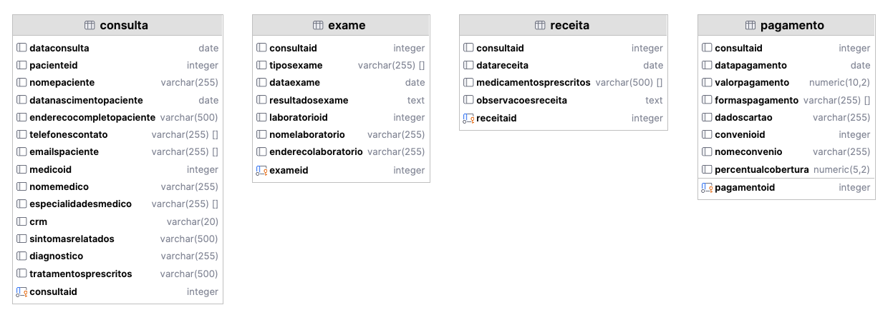
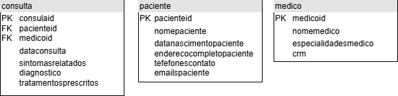
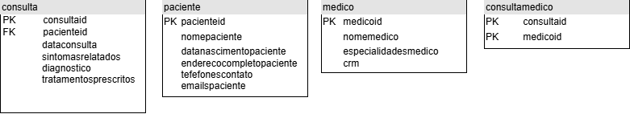
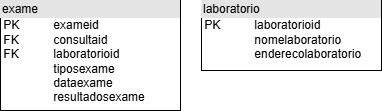

# Identificação de Problemas

- [**Consulta**](#consulta)
- [**Exame**](#exame)
- [**Receita**](#receita)
- [**Pagamento**](#pagamento)

## Consulta

Ao analisar os atributos da tabela de **Consulta**, observa-se que ela concentra **muitas responsabilidades**, armazenando informações tanto do paciente quanto do médico. Essa abordagem **viola os princípios da boa modelagem e acarreta uma complexidade desnecessária** na criação de cada registro, uma vez que mistura atributos de entidades conceitualmente distintas. Além disso, surgem **diversas anomalias**:

- **Anomalias de inserção**: a adição de novas consultas exige a repetição de dados do paciente e do médico; se uma mesma consulta envolver mais de um médico, será necessário repetir os dados da consulta e do paciente para cada médico adicional.

- **Anomalias de remoção**: ao excluir um registro de consulta, corre-se o risco de também eliminar, inadvertidamente, informações relevantes sobre o paciente ou o médico, caso não haja outras consultas associadas a eles.

- **Anomalias de modificação**: qualquer atualização em dados do paciente ou do médico (por exemplo, um telefone ou especialidade) requer que todas as tuplas em que esses dados aparecem sejam alteradas, o que é propenso a erros e inconsistências.

Para evitar esses problemas e **atender aos princípios de normalização**, os dados foram devidamente separados em duas entidades distintas: **Paciente** e **Médico**, cada uma responsável por armazenar exclusivamente os atributos pertinentes ao seu domínio. Essa decomposição reduz a redundância, melhora a integridade dos dados e facilita as operações de inserção, atualização e exclusão no banco.

> Observação: *"Seria interessante poder ter múltiplos médicos atendendo a uma mesma consulta (consulta multidisciplinar)."*

Considerando a nova estrutura das entidades, para adicionar diferentes médicos à mesma consulta sem incorrer em anomalias, é necessário criar uma nova entidade que represente esse relacionamento **n para n**. Dessa forma, foi adicionada a entidade **ConsultaMedico**, que viabiliza o vínculo de múltiplos médicos a uma única consulta, mantendo a integridade e a normalização do modelo de dados.

## Exame

Ao analisar os atributos da tabela de **Exame**, observa-se que ela também concentra responsabilidades que poderiam ser destinadas a outra entidade. Essa estrutura resulta nas seguintes **anomalias**:

- **Anomalia de inserção**: a adição de novos exames exige a repetição de dados relacionados ao laboratório.

- **Anomalia de remoção**: ao excluir um registro de exame, corre-se o risco de também eliminar, inadvertidamente, informações relevantes sobre o laboratório, caso não existam outros registros associados a ele.

- **Anomalia de modificação**: qualquer atualização nos dados do laboratório exige a alteração de todas as tuplas em que esses dados aparecem, o que é propenso a erros e inconsistências.

Para evitar esses problemas e **atender aos princípios de normalização**, os dados foram devidamente separados em uma nova entidade: **Laboratório**, responsável por armazenar exclusivamente os atributos pertinentes ao seu domínio.

## Receita

> Observação: *"O tratamento pode envolver múltiplas ações (medicação, fisioterapia, cirurgia, etc.)."*

Considerando a estrutura atual da entidade **Receita**, seria necessário adicionar uma complexidade excessiva a essa entidade para contemplar todos os tipos de tratamento, o que aumentaria a probabilidade de ocorrência de anomalias. 

Para evitar esses problemas e manter o modelo normalizado, foi criada uma nova entidade chamada **Medicamento**, responsável por armazenar as informações específicas dos medicamentos prescritos. 

Além disso, como há uma relação **n para n** entre **Receita** e **Medicamento**, foi criada uma tabela auxiliar chamada **ReceitaMedicamento**, que permite associar múltiplos medicamentos a uma única receita e, ao mesmo tempo, reutilizar medicamentos em diferentes receitas sem redundância.

PS: Colocar imagem aqui

## Pagamento

A estrutura original da tabela `pagamento` apresentava **múltiplas responsabilidades em uma única entidade**, armazenando informações sobre a consulta, formas de pagamento, dados de cartão, convênio e percentual de cobertura. Essa abordagem resultava em diversas **anomalias**, como:

- **Anomalia de inserção**: ao registrar um pagamento com múltiplas formas (por exemplo, parte em dinheiro e parte no cartão), seria necessário repetir os mesmos dados do pagamento e da consulta para cada forma de pagamento.
- **Anomalia de modificação**: ao atualizar o percentual de cobertura de um convênio, seria necessário alterar todas as ocorrências desse dado em diferentes linhas da tabela, aumentando o risco de inconsistências.
- **Anomalia de remoção**: ao excluir um pagamento, informações importantes sobre o convênio poderiam ser perdidas, caso estivessem apenas associadas a esse pagamento.

PS: Colocar imagem aqui

> Observação: *O pagamento pode ser feito de forma parcelada ou com múltiplas formas de pagamento.*

A nova modelagem permite representar esse cenário de forma adequada, uma vez que a tabela `FormaPagamento` suporta várias entradas para o mesmo `PagamentoID`, viabilizando o controle detalhado de **parcelas ou formas combinadas de pagamento**.

Essa estrutura melhora a integridade dos dados, facilita manutenção futura e está em conformidade com os **princípios da normalização**, reduzindo redundância e prevenindo inconsistências.

PS: Colocar imagem aqui
